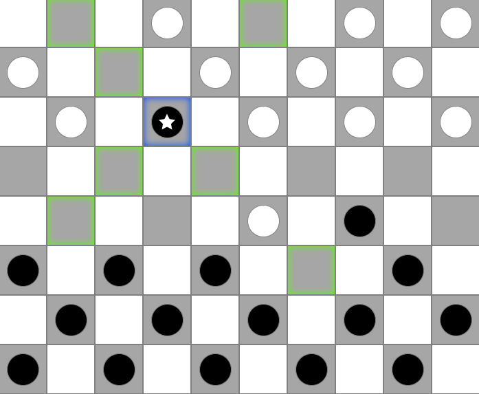
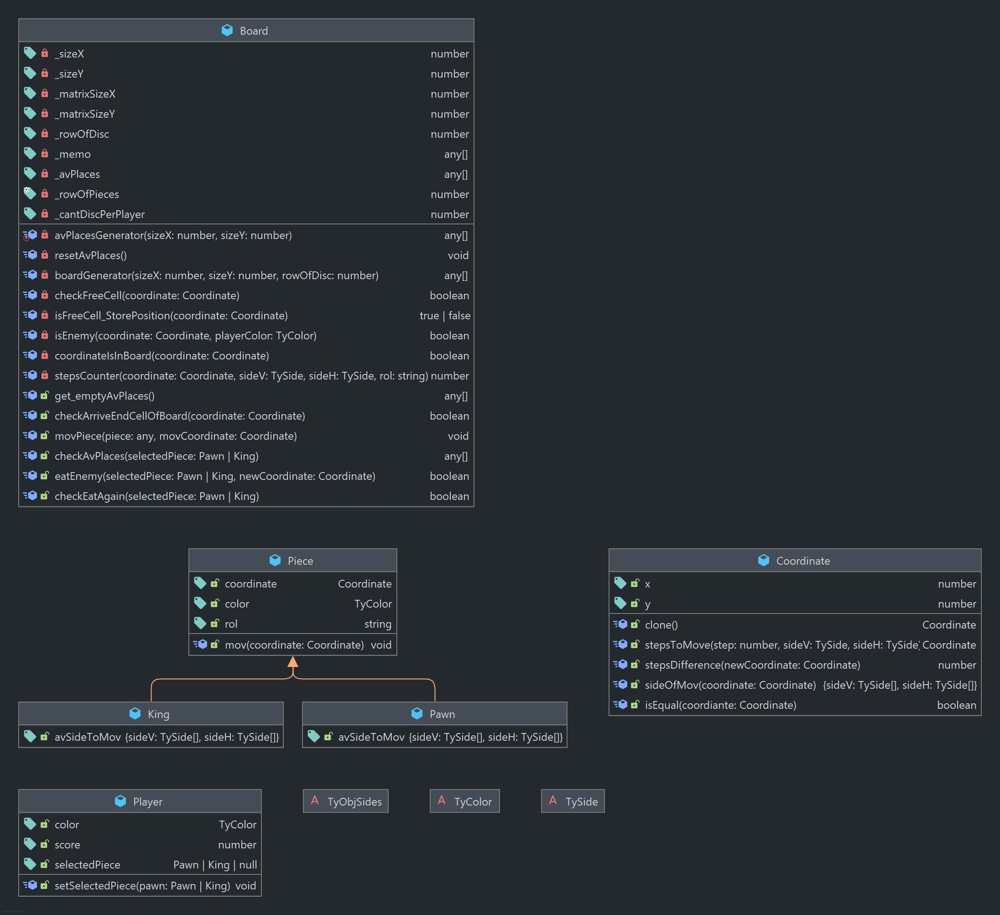

# Juego de Damas

>Estado del proyecto
>- [x] Generacion de tablero
>- [x] Funcion checkAvPlaces :arrow_right: determina lugares libres
>- [x] Funcion eatEnemy :arrow_right: determina borrar(comer) enemigo
>- [x] Funcion checkEatAgain :arrow_right: determina si puede mover nuevamente el mismo jugador
>- [x] Funcion checkArriveEndCellOfBoard :arrow_right: determina si el peon llego al final del tablero para convertise en Dama
>- [ ] Funcion :arrow_right: determina si termino el juego en empate o victoria
>- [ ] UI :arrow_right: mecanica de puntos
>- [ ] UI :arrow_right: mostrar puntos de los jugadores

> ## Captura de tablero
>
> #### Damas
> 
> 
>  

   

> ## Diagrama de Clases 
> 
>  

  

>In the project directory, you can run:
>
>### `npm start`
>
>Runs the app in the development mode.\
>Open [http://localhost:3000](http://localhost:3000) to view it in the browser.

